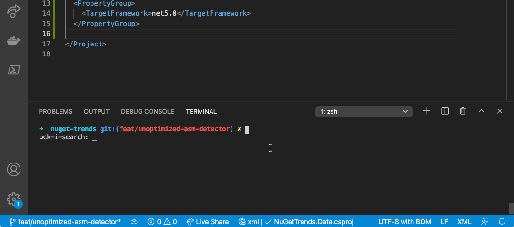
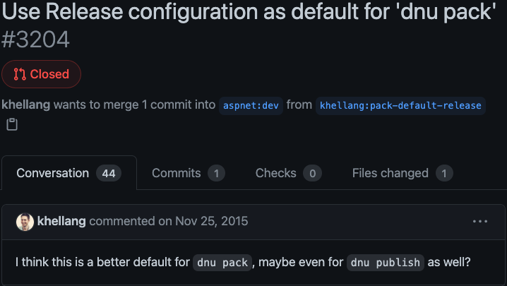
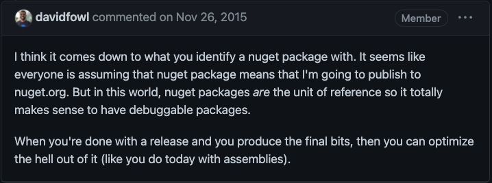

## Summary

You might unknowingly be using an unoptimized dependency which could impact the performance of your app.
Now, it's easy to get a warning if that happens, at build time,
using the NuGet package [`UnoptimizedAssemblyDetector`](https://www.nuget.org/packages/UnoptimizedAssemblyDetector/):

```xml
<PackageReference Include="UnoptimizedAssemblyDetector" Version="0.1.0">
  <PrivateAssets>all</PrivateAssets>
</PackageReference>
```

After you add this NuGet package, a warning will be included in your build if any unoptimized assembly is detected.

[](unoptimized-assembly-detected.gif)

The source code of project is [hosted on GitHub](https://github.com/bruno-garcia/unoptimized-assembly-detector) ⭐.

## What's the pitfall?

The default build configuration for `dotnet pack` and `dotnet publish` is not `Release` as you might assume or expect.
When publishing NuGet packages to _nuget.org_, one must explicitly make it a release package, like: `dotnet pack -c Release`. Without it, the assemblies packed will not be compiled with optimizations.
In this blog post you'll learn that's not always the case. Even for those who know, accidents happens and a misconfigured build script can result in a `Debug` build ending up on _nuget.org_.

The default value being `Debug`, which results in unoptimized assemblies, isn't alone the reason why this is a pitfall.
There's no warning of any kind from the point you create the NuGet package, through uploading to _nuget.org_ all the way to restoring it for your project.

## Why should I care?

If you don't need convincing, feel free to skip ahead to [Sensible defaults](#sensible-defaults).

### Benchmarks

I would include benchmarks using `BenchmarkDotNet` but it refuses to run Debug builds:

```
➜ dotnet run
// Validating benchmarks:
Assembly UnoptimizedBenchmarks which defines benchmarks is non-optimized
Benchmark was built without optimization enabled (most probably a DEBUG configuration). Please, build it in RELEASE.
If you want to debug the benchmarks, please see https://benchmarkdotnet.org/articles/guides/troubleshooting.html#debugging-benchmarks.
```

### Optimizations

> Never use the Debug build for benchmarking. Never. The debug version of the target method can run 10–100 times slower.

This came from [BenchmarkDotNet's Good Practices](https://benchmarkdotnet.org/articles/guides/good-practices.html) documentation. The impact that it causes to your application might not be as severe or noticeable. Ironically, benchmarking is one of the tools to measure that.

The [C# compiler docs](https://docs.microsoft.com/en-us/dotnet/csharp/language-reference/compiler-options/code-generation#optimize) state:

> The Optimize option enables or disables optimizations performed by the compiler to make your output file smaller, faster, and more efficient. The Optimize option is enabled by default for a Release build configuration. It is off by default for a Debug build configuration.

If that wasn't enough to convince you, maybe Eric Lippert, former Principal Engineer in the C# language design team's blog post from 2009 will help. [Thanks to archive.org](https://web.archive.org/web/20110802071721/http://blogs.msdn.com/b/ericlippert/archive/2009/06/11/what-does-the-optimize-switch-do.aspx):

* Expressions which are determined to be only useful for their side effects are turned into code that merely produces the side effects.
* We omit generating code for things like `int foo = 0;` because we know that the memory allocator will initialize fields to default values.
* We omit emitting and generating empty static class constructors. (Which typically happens if the static constructor set all the fields to their default value and the previous optimization eliminated all of them.)
* We omit emitting a field for any hoisted locals that are unused in an iterator block. (This includes that case where the local in question is used only inside an anonymous function in the iterator block, in which case it is going to become hoisted into a field of the closure class for the anonymous function. No need to hoist it twice if we don’t need to.)
* We attempt to minimize the number of local variable and temporary slots allocated. For example, if you have:

```
for (int i = …) {…}
for (int i = …) {…}
```

then the compiler could generate code to re-use the local variable storage reserved for `i` when the second `i` comes along. (We eschew this optimization if the locals have different names because then it gets hard to emit sensible debug info, which we still want to do even for the optimized build. However, the jitter is free to perform this optimization if it wishes to.)

* Also, if you have a local which is never used at all, then there is no storage allocated for it if the flag is set.
* Similarly, the compiler is more aggressive about re-using the unnamed temporary slots sometimes used to store results of subexpression calculations.
* Also, with the flag set the compiler is more aggressive about generating code that throws away “temporary” values quickly for things like controlling variables of switch statements, the condition in an “if” statement, the value being returned, and so on. In the non-optimized build these values are treated as unnamed local variables, loaded from and stored to specific locations. In the optimized build they can often be just kept on the stack proper.
* We eliminate pretty much all of the “breakpoint convenience” no-ops.
* If a try block is empty then clearly the catch blocks are not reachable and can be trimmed. (Finally blocks of empty tries are preserved as protected regions because they have unusual behaviour when faced with certain exceptions; see the comments for details.) 
* If we have an instruction which branches to `LABEL1`, and the instruction at `LABEL1` branches to `LABEL2`, then we rewrite the first instruction as a branch straight to `LABEL2`. Same with branches that go to returns.
* We look for “branch over a branch” situations. For example, here we go to `LABEL1` if condition is false, otherwise we go to `LABEL2`.

```
brfalse condition, LABEL1
br LABEL2
LABEL1: somecode
```

Since we are simply branching over another branch, we can rewrite this as simply "if condition is true, go to `LABEL2`":

```
brtrue condition, LABEL2
somecode
```

* We look for “branch to nop” situations. If a branch goes to a nop then you can make it branch to the instruction after the nop.
* We look for “branch to next” situations; if a branch goes to the next instruction then you can eliminate it.
* We look for two return instructions in a row; this happens sometimes and obviously we can turn it into a single return instruction.

Since writing this, Eric Lippert left Microsoft and the C# compiler was rewritten and open sourced.
You can browse the [Roslyn's](http://github.com/dotnet/roslyn) repository and you'll [discover that new optimizations are still being suggested](https://github.com/dotnet/roslyn/issues?q=is%3Aissue+is%3Aopen+optimization+proposal) and added.

## Sensible defaults

I've been talking about packaging NuGet with `Release` configuration then talking about Roslyn optimization.
These two things are not exactly the same (though by default related) and I wish to clarify.

The `Release` configuration, by default does provide the `-optimize+` flag to the C# compiler 
but you can achieve the same for example by means of a MSBuild property `<Optimize>true</Optimize>`.
I hope the quote from the docs I include help make this clear.

> Optimize also tells the common language runtime to optimize code at runtime. By default, optimizations are disabled. Specify Optimize+ to enable optimizations. When building a module to be used by an assembly, use the same Optimize settings as used by the assembly. It's possible to combine the Optimize and Debug options.

[This passage from the C# compiler docs](https://docs.microsoft.com/en-us/dotnet/csharp/language-reference/compiler-options/code-generation#optimize) isn't something new, and there has been a lot of debate about whether the default should be changed to `Release`.

### Release as default

[](https://github.com/aspnet/dnx/pull/3204)

To me, it sounded pretty obvious at first that this should the right thing to do. As it did for a lot of folks on that thread.
But it turns out the .NET team has strong and valid opinions to why that shouldn't be the case.

[](https://github.com/aspnet/dnx/pull/3204#issuecomment-159985967)

## Anything that can go wrong will go wrong - [Kristian Murphy Hellang](https://twitter.com/khellang)

Regardless of which side of the debate you stand, the truth of the matter is that we're left with packages being published to _nuget.org_ with assemblies compiled without optimization.


<br>
<div align="center">
<blockquote class="twitter-tweet"><p lang="en" dir="ltr">StructureMap 4.4.1 is up. No code changes, but corrects the problem of the nuget being built as Debug for 4.3.0 and 4.4.0. Oops on my part.</p>&mdash; jeremydmiller (@jeremydmiller) <a href="https://twitter.com/jeremydmiller/status/777571510919630848?ref_src=twsrc%5Etfw">September 18, 2016</a></blockquote> <script async src="https://platform.twitter.com/widgets.js" charset="utf-8"></script>
<blockquote class="twitter-tweet"><p lang="en" dir="ltr">I knew this would happen. I&#39;ve done it myself and you won&#39;t be the last. More debug builds on NuGet ahead. <a href="https://twitter.com/davidfowl?ref_src=twsrc%5Etfw">@davidfowl</a></p>&mdash; Kristian Hellang (@khellang) <a href="https://twitter.com/khellang/status/777753550491353088?ref_src=twsrc%5Etfw">September 19, 2016</a></blockquote> <script async src="https://platform.twitter.com/widgets.js" charset="utf-8"></script>
</div>
<br>


I feel like publishing packages to _nuget.org_ relates a lot to sailing and running aground:

> There are three kinds of skippers, those who have run aground, those who will run aground, and those that have but won't admit it.

Replace _skippers_ with _package authors_ and _running aground_ with _publish packages built in debug_ and there you have it.

Publishing unoptimized bits also happened to Sentry's _SharpRaven_ SDK back in 2018. If you're using [SharpRaven version 2.3.0](https://www.nuget.org/packages/SharpRaven/2.3.0), you're running an unoptimized assembly. I would recommend you [upgrade it to 2.3.1](https://github.com/getsentry/raven-csharp/pull/226/files) but on that same year that package was replaced by [Sentry](https://www.nuget.org/packages/Sentry/). Don't worry, it's [packaged in release mode](https://github.com/getsentry/sentry-dotnet/blob/bc4c5e23eaaaa848a9a44ae05ac257a591624b24/build.ps1#L14). Not that you should take my word for it.

In early 2020, I even [opened a PR to add this verification to the Sentry SDK for .NET](https://github.com/getsentry/sentry-dotnet/pull/365/files) so it would check assemblies being loaded whether they were optimized or not, and send events to Sentry when applicable. But it never felt like the right thing to do. This verification must happen much earlier, at latest during build time.

## My days are numbered

That's a gloomy heading. It's the `UnoptimizedAssemblyDetector` NuGet package talking though, not me.
I built this package in hopes for it to become obsolete one day. Not because I expect the default of `dotnet pack` to ever change.
Clearly it won't. But I believe such warnings should be part of NuGet itself.

When you push a NuGet package to _nuget.org_, it should verify if the managed assemblies under `lib/` are indeed compiled with optimization, and if not, it should warn the author.
At the same time, when restoring such package, it should warn the consumer. This part in particular will make `UnoptimizedAssemblyDetector` redundant.

What else can **we** do? [NuGet Trends](https://github.com/dotnet/nuget-trends) has the complete catalog. It could be extended to download the packages and inspect the assemblies in them. With that, create graphs and expose an endpoint to list unoptimized assemblies.

Well that, and ask the NuGet team to add these checks during package upload/restore.


--

Cover photo by <a href="https://unsplash.com/@amir_v_ali?utm_source=unsplash&utm_medium=referral&utm_content=creditCopyText">amirali mirhashemian</a> on <a href="https://unsplash.com/?utm_source=unsplash&utm_medium=referral&utm_content=creditCopyText">Unsplash</a>

